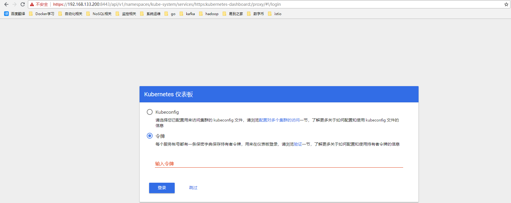

# 11.核心组件安装之 dashboard
#### 准备相关文件
将下载的 kubernetes-server-linux-amd64.tar.gz 解压后，再解压其中的 kubernetes-src.tar.gz 文件。dashboard 对应的目录是：
```
$ cd ~/kubernetes
$ tar zxf kubernetes-src.tar.gz
$ ll cluster/addons/dashboard/
总用量 32
-rw-rw-r--. 1 root root  264 8月   7 15:49 dashboard-configmap.yaml
-rw-rw-r--. 1 root root 1821 8月   7 15:49 dashboard-controller.yaml
-rw-rw-r--. 1 root root 1353 8月   7 15:49 dashboard-rbac.yaml
-rw-rw-r--. 1 root root  551 8月   7 15:49 dashboard-secret.yaml
-rw-rw-r--. 1 root root  322 8月   7 15:49 dashboard-service.yaml
-rw-rw-r--. 1 root root  242 8月   7 15:49 MAINTAINERS.md
-rw-rw-r--. 1 root root   72 8月   7 15:49 OWNERS
-rw-rw-r--. 1 root root  400 8月   7 15:49 README.md
```
#### 修改yml中的镜像
```
$ grep "k8s.gcr.io" dashboard-controller.yaml 
        image: k8s.gcr.io/kubernetes-dashboard-amd64:v1.8.3
$ sed -i 's#image: k8s.gcr.io/kubernetes-dashboard-amd64:v1.8.3#image: hexun/kubernetes-dashboard-amd64:v1.8.3#' dashboard-controller.yaml 
$ grep "image" dashboard-controller.yaml 
        image: hexun/kubernetes-dashboard-amd64:v1.8.3
```
#### 执行所定义的文件
```
kubectl create -f  .
```
#### 查看dashboard运行情况
```
$ kubectl get deployment kubernetes-dashboard  -n kube-system
NAME                   DESIRED   CURRENT   UP-TO-DATE   AVAILABLE   AGE
kubernetes-dashboard   1         1         1            1           1d
$ kubectl --namespace kube-system get pods -o wide
NAME                                      READY     STATUS    RESTARTS   AGE       IP                NODE      NOMINATED NODE
calico-kube-controllers-b49d9b875-zx5m7   1/1       Running   2          1d        192.168.133.130   k8s-m03   <none>
calico-node-8ctw7                         2/2       Running   4          1d        192.168.133.132   k8s-n02   <none>
calico-node-gjvqv                         2/2       Running   4          1d        192.168.133.129   k8s-m02   <none>
calico-node-qnh52                         2/2       Running   4          1d        192.168.133.130   k8s-m03   <none>
calico-node-rptbk                         2/2       Running   4          1d        192.168.133.131   k8s-n01   <none>
calico-node-tnn6z                         2/2       Running   4          1d        192.168.133.128   k8s-m01   <none>
coredns-6c65fc5cbb-84nd6                  1/1       Running   1          1d        172.30.217.7      k8s-m02   <none>
coredns-6c65fc5cbb-w5cnv                  1/1       Running   1          1d        172.30.57.69      k8s-n02   <none>
heapster-v1.5.3-8576fc9556-7wd8m          2/2       Running   0          23h       172.30.205.133    k8s-m03   <none>
kubernetes-dashboard-58d7567f97-nn44t     1/1       Running   2          1d        172.30.217.8      k8s-m02   <none>
$ kubectl get services kubernetes-dashboard -n kube-system
NAME                   TYPE        CLUSTER-IP    EXTERNAL-IP   PORT(S)   AGE
kubernetes-dashboard   ClusterIP   10.254.7.82   <none>        443/TCP   1d
```
从上面可以看出这里我们没有使用NodePort的方式暴露端口，所以在访问服务的时候略微复杂;dashboard 的 --authentication-mode 支持 token、basic，默认为 token。如果使用 basic，则 kube-apiserver 必须配置 '--authorization-mode=ABAC' 和 '--basic-auth-file' 参数。
#### 访问 dashboard
当前访问dashboard方式总结如下：
 + NodePort方式，不建议在生产环境（如果被攻击，你所有的应用将面临巨大的危险）;
 + kube proxy方式，但是只能在localhosts 和 127.0.0.1 下访问，限制略大以及配置起来麻烦;
 + kube-apiserver方式，我这里就是使用这种方式;
 + ingress 方式进行代理，这个后续实现;
通过kube-apiserver方式，首先查看集群信息：
```
[root@k8s-m01 ~]# kubectl cluster-info
Kubernetes master is running at https://192.168.133.200:8443
Heapster is running at https://192.168.133.200:8443/api/v1/namespaces/kube-system/services/heapster/proxy
CoreDNS is running at https://192.168.133.200:8443/api/v1/namespaces/kube-system/services/kube-dns:dns/proxy
kubernetes-dashboard is running at https://192.168.133.200:8443/api/v1/namespaces/kube-system/services/https:kubernetes-dashboard:/proxy

To further debug and diagnose cluster problems, use 'kubectl cluster-info dump'.
```
初次尝试访问，https://192.168.133.200:8443/api/v1/namespaces/kube-system/services/https:kubernetes-dashboard:/proxy ,提示证书已信任，但是出现401错误


我们需要给浏览器生成一个 client 证书，访问 apiserver 的 6443 https 端口时使用。
这里使用部署 kubectl 命令行工具时创建的 admin 证书、私钥和上面的 ca 证书，创建一个浏览器可以使用 PKCS#12/PFX 格式的证书：
```
openssl pkcs12 -export -out admin.pfx -inkey admin-key.pem -in admin.pem -certfile ca.pem
```
将创建的 admin.pfx 导入到浏览器中。对于chrome，操作如下：

跟着一布一步操作，导入即可看到如下所示

然后重启浏览器，再次访问 https://192.168.133.200:8443/api/v1/namespaces/kube-system/services/https:kubernetes-dashboard:/proxy ,此时会提示选择一个浏览器证书，这里选中上面导入的 admin.pfx

####  创建登录 Dashboard 的 token
```
$ kubectl create sa dashboard-admin -n kube-system
$ kubectl create clusterrolebinding dashboard-admin --clusterrole=cluster-admin --serviceaccount=kube-system:dashboard-admin
$ ADMIN_SECRET=$(kubectl get secrets -n kube-system | grep dashboard-admin | awk '{print $1}')
$ DASHBOARD_LOGIN_TOKEN=$(kubectl describe secret -n kube-system ${ADMIN_SECRET} | grep -E '^token' | awk '{print $2}')
$ echo ${DASHBOARD_LOGIN_TOKEN}
```
通过token直接访问即可;
